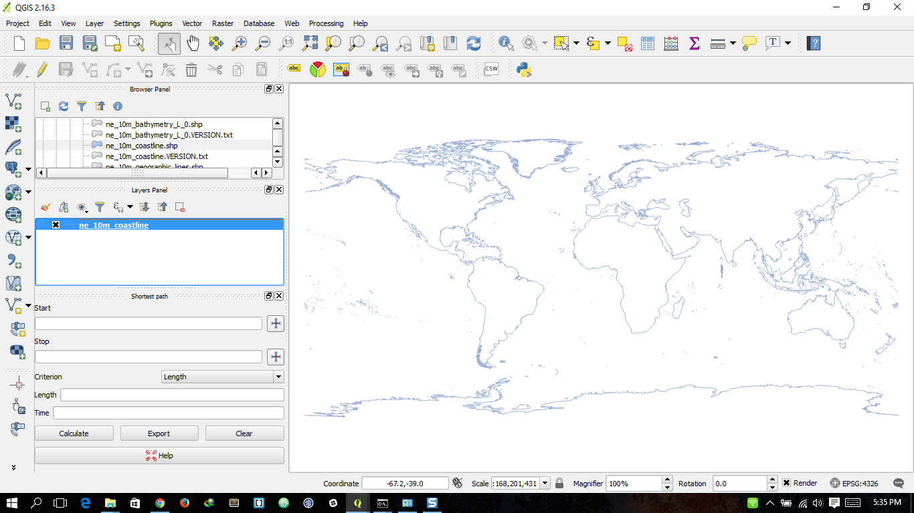

# GIS--Geographic-Information-Systems

# Latar Belakang Masalah :
* Definisi Geospasial?
* Bagaimana Gambaran dari Informasi Geospasial
  - Informasi Geospasial Dasar
  - Informasi Geospasial Tematik

  

Geospasial yang adalah keruangan yang menunjukkan lokasi, wilayah, letak dan posisi suatu objek yang berada dibawah atau diatas permukaan bumi 
yang dinyatakan pada system titik koordinat tertentu.

Informasi Geospasial mempunyai pengertian yaitu data Geospasial yang telah diolah sehingga dapat digunakan untuk alat bantu.
Dibedakan menjadi dua yaitu 
* Informasi Geospasial Dasar adalah penyajian Informasi Geospasial yang berkaitan dengan objek yang dapat dilihat secara langsung.
* Informasi Geospasial Tematik adalah Informasi Geospasial yang mensajikan satu atau lebih tema tertentu yg dibuat dengan mengacu Informasi Geospasial Dasar

## Kesimpulan 

jadi di pertemuan kedua ini dapat disimpulkan geospasial menunjukan suatu lokasi atau letak dari sebuah wilayah, yang memiliki dua Informasi yaitu Geospasial dasar dan Geospasial Tematik

## Saran

Sering Praktek langsung dan membagikan ilmu tentang Python. 

Nama : Muhammad Firman Kahfi
 
NPM : 1144015
 
Kelas : 3B
 
Prodi : D4 Teknik Informatika
 
Mata Kuliah : Sistem Informasi Geografis
 

* Link Github : https://github.com/FirmanMFK/GIS--Geographic-Information-Systems
* Link Youtube :https://www.youtube.com/watch?v=y2V_jIoc-ts&feature=youtu.be
Referensi :
* www.naturalearthdata.com
* http://www.slideshare.net/aryapinandita/peran-data-dan-informasi-geospasial-dalam-penataan-ruang

Link Plagiarism Via Duplichecker : https://drive.google.com/file/d/0BzrCjHLyhoFsd1E4XzhNVlRnUWM/view?usp=sharing

Via SmallSeoTools : https://drive.google.com/file/d/0BzrCjHLyhoFsblJpZWRZOEZFb1E/view?usp=sharing