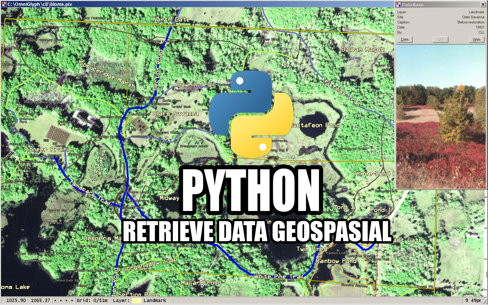

# GIS--Geographic-Information-Systems

# Latar Belakang Masalah :

1).Bagaimana Cara melakukan Select View data Record dari File dbf dan geometri
 
2).Seperti apa membuat Class di Python untuk menampilkan retrieve data geospasial

  

Select View Data Record dari file dbf dan geometri
Import shapefile

-sf = shapefile.Reader(“nama.shp”)

Hitung berapa jumlah Record

Membuka dbf ;

-sf.records()

-sf.record(n)

-sf.fields = melihat daftar nama field

Membuka shp :

-sf.shapes()

-sf.shape(n)

-dir(shapes)

Contoh 1 (hitung record)

a = sf.shapes() -> retrieve all data geometri

Len(a) = digunakan untuk menghitung jumlah record di variable a dimana len() itu fungsi menghitung jumlah arrow/dict dalam variable

Contoh 2 (melihat nama fields)

Nama.file = sf.fields

Print nama.fields

Class 

Import shapefile

Class gede(object) :

Def hitungbaris(self.namafile)

Sf = shapefile.Reader(namafile)

Record = sf.shapes()

Return len(rec)

-Import gede

-inst = gede.Gede()

-inst.hitungbaris(“shp/bts_negara.shp”)

Constract

Import shapefile

Class gede(object) :

Def_init_(shelf,namafile):

Self.sf = shapefile.Reader(namafile)

Def hitungbaris (self)

Rec = self.sf.shapes()

Return len(rec)

## Kesimpulan 

Dengan membuat class di python yang sesuai dengan file.py akan membuat  kita bisa melihat record data.
Dengan perintah perintah yang sudah dipraktekan kita menjadi lebih tahu hal hal yang baru di Python. 

## Saran
Praktek Coding Python sudah bagus tapi mungkin untuk memahami dokumentasi kurang karena fundamentalnya harus diperkuat
diawal agar bisa mengikuti dengan baik.

Nama : Muhammad Firman Kahfi
 
NPM : 1144015
 
Kelas : 3B
 
Prodi : D4 Teknik Informatika
 
Mata Kuliah : Sistem Informasi Geografis
 

* Link Github : https://github.com/FirmanMFK/GIS--Geographic-Information-Systems
* Link Youtube : https://www.youtube.com/watch?v=WL2NGdxzVi0

## Referensi :
* www.naturalearthdata.com
* https://wiki.python.org/moin/BeginnersGuide

## Scan Plagiarism
Link Plagiarism Via Duplichecker : https://drive.google.com/file/d/0BzrCjHLyhoFsVlBRazdCaG0wcHM/view?usp=sharing
 
Link Plagiarism Via Smallseotools : https://drive.google.com/file/d/0BzrCjHLyhoFsRVdMQmJZc0pUa2c/view?usp=sharing