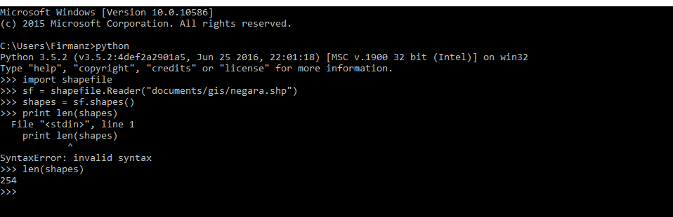
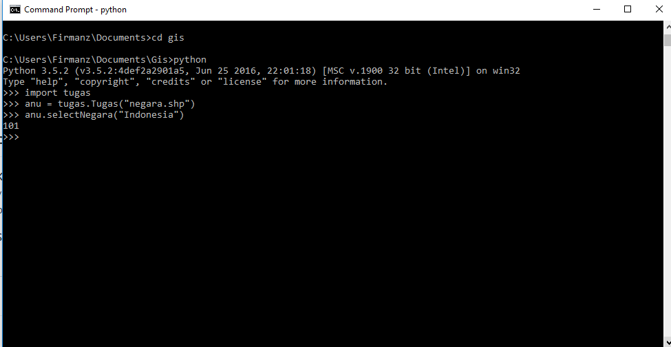

## Sistem Informasi Geografis - Pertemuan 4

##  RETRIVE DATA GEOSPASIAL

  

 

LATAR BELAKANG MASALAH
Retrieve Data Geospasial ialah Meretrieve Data Vektor.

Geometri Data koordinat yang membentuk bangun datar/ruang diantaranya:

1.Point/titik [1]
 
2.Line/garis [3] Shape,type
 
3.Polygon [5]
 

## Terdapat 3 geometri standar ESRI

1.Point
 
2.Poline
 
3.Poligon
 

## Operasi pada Pyhton

Library pyshp yaitu adalah IMPORT SHAPFILE penjelasan instansi kelas shapfile kepada sebuah variable

Sf = shapefile.Reader(‘Bts.shp’)

Penjelasan :

SF = Variable

Shapfile = Sebuah class

Reader = Method

Bts,shp = Parameter file

Method method pada data DBF dan SHP

Method pada data DBF

sf.fileds() adalah untuk melihat attribute table

sf.records() adalah untuk mengambil semua record

sf.record(n) adalah untuk isi record

Method pada data SHP

Sf.shapes() adalah untuk mengambil semua record geometri

Sf.shape(n) adalah untuk mengambil 1 record pada baris n
Cara untuk mengambil 1 record dengan parameter nilai atau Array

sf.records(0) [8]

sf.field(0) [8]

Titik koordinat terdapat 4 titik

BBOX

POINT

SHAPETYPE

Contoh Code untuk menampilkan nama Negara memakai contruk .

For a in sf.records():

If a[8] = “Indonesia””

Print a

Atau bisa juga

I = 0

For a in sf.records():

If a[8] ==”Zimbabwe”:

Print a :

I = i+1

# Praktikum

Menampilkan jumlah record melalui terminal

  

 

Masukan Kode didalam tugas.py

  

Membuat  Method Select, Where Negara Indonesia Output Data Record Negara Indonesia

  

## Kesimpulan 

Dengan membuat class di python yang sesuai dengan file.py akan membuat  kita bisa melihat record data.
Dengan perintah perintah yang sudah dipraktekan kita menjadi lebih tahu hal hal yang baru di Python. 

## Saran
Pengembangan GIS untuk User dan bagaimana penerapannya dgn bahasa python harus dipraktekan.

Nama : Muhammad Firman Kahfi
 
NPM : 1144015
 
Kelas : 3B
 
Prodi : D4 Teknik Informatika
 
Mata Kuliah : Sistem Informasi Geografis
 

* Link Github : https://github.com/FirmanMFK/GIS--Geographic-Information-Systems

* https://wiki.python.org/moin/BeginnersGuide
* https://www.python.org/doc/

## Scan Plagiarism
